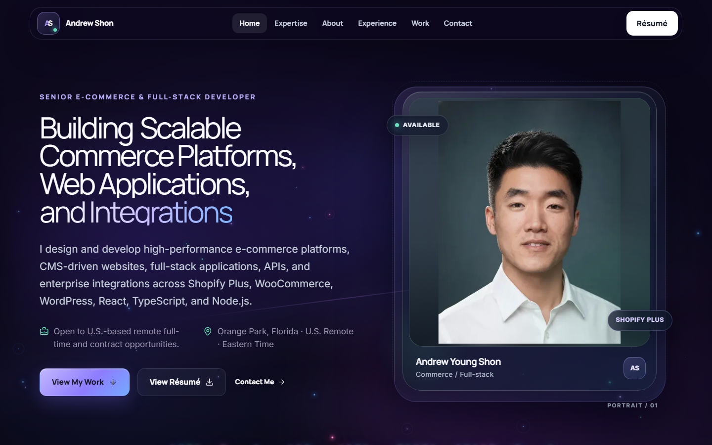
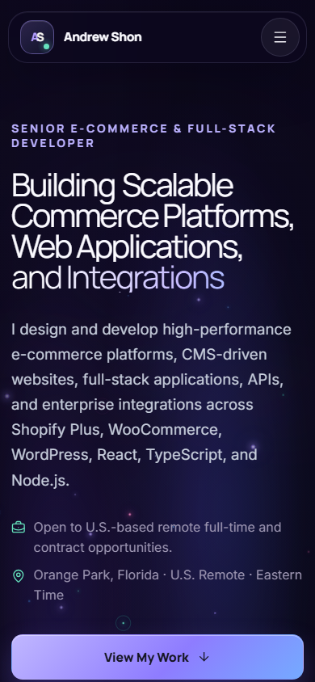
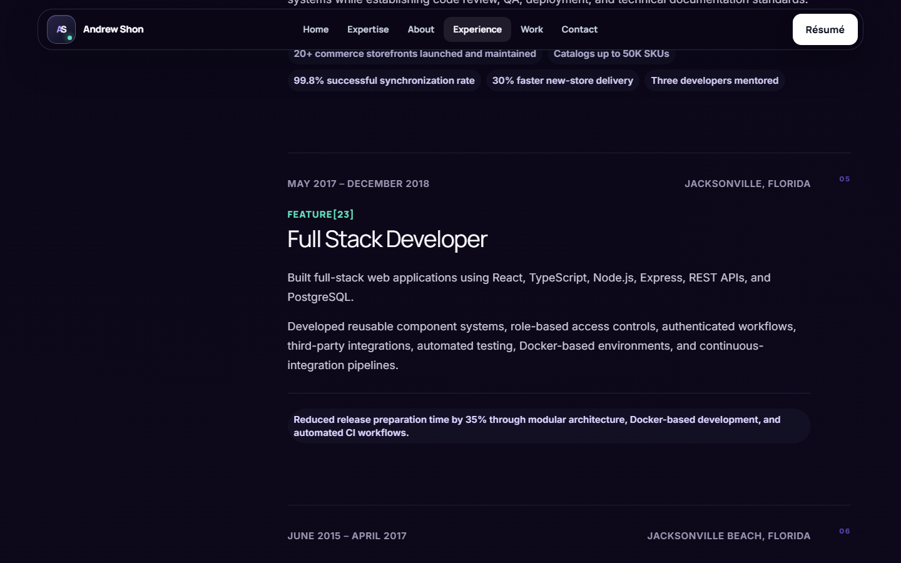

# Andrew Young Shon

Portfolio site for my work as a senior e-commerce & full-stack developer —
Shopify Plus, WooCommerce, WordPress, React, TypeScript, Node.js, APIs, and
integrations.

**Live site:** [portfolio-site-andrew-shon.vercel.app](https://portfolio-site-andrew-shon.vercel.app)



<p align="center">
  
</p>



## What's in the repo

This is a Next.js App Router site. Copy and project data sit in typed files under
`src/content`, so most content edits happen there instead of buried in page
components.

The homepage covers expertise, experience, six selected case studies, credentials,
and a contact form. There’s also an HTML résumé at `/resume` and a PDF at
`/Andrew_Young_Shon_Resume.pdf`.

## Stack

- Next.js 16 + React 19
- TypeScript
- Tailwind CSS 4
- Zod (shared client/server contact validation)
- Vitest / Testing Library
- Playwright (+ axe for a11y checks)

## Run it locally

Needs Node 20.19+.

```bash
npm install
cp .env.example .env.local
npm run dev
```

Then open [http://localhost:3000](http://localhost:3000).

Useful scripts:

```bash
npm run check      # format, lint, types, unit tests, build
npm run test       # unit tests
npm run test:e2e   # Playwright
npm run build
```

## Environment

| Variable                        | Notes                                                           |
| ------------------------------- | --------------------------------------------------------------- |
| `NEXT_PUBLIC_SITE_URL`          | Production URL (canonical links + sitemap). Set this in Vercel. |
| `NEXT_PUBLIC_LINKEDIN_URL`      | Optional. Hidden if empty.                                      |
| `NEXT_PUBLIC_GITHUB_URL`        | Optional. Hidden if empty.                                      |
| `NEXT_PUBLIC_GA_MEASUREMENT_ID` | Optional GA4.                                                   |
| `RESEND_API_KEY`                | Optional. Server-only.                                          |
| `CONTACT_TO_EMAIL`              | Defaults to my email if unset.                                  |
| `CONTACT_FROM_EMAIL`            | Needed with Resend for in-app sending.                          |

Without Resend, the contact form falls back to a `mailto:` link so messages
still go out. Don’t commit `.env.local`.

## Deploy

The project is already hooked up to Vercel from this repo. Pushing to `main`
triggers a production deploy.

If you’re setting it up fresh: import the repo as a Next.js project, keep the
default build command, and set `NEXT_PUBLIC_SITE_URL` to the live origin.

## Editing content

| What                   | Where                           |
| ---------------------- | ------------------------------- |
| Site / contact details | `src/content/site.ts`           |
| Projects               | `src/content/projects.ts`       |
| Experience             | `src/content/experience.ts`     |
| Credentials            | `src/content/certifications.ts` |

Only publish facts I've verified. Employment dates, credential IDs/URLs, and
project claims shouldn't be guessed or "filled in." More detail on that lives
in `AGENTS.md`.

## Screenshots

Fresh captures from the live site live in `docs/screenshots/`:

- `home-desktop.png`
- `home-mobile.png`
- `work-section.png`
